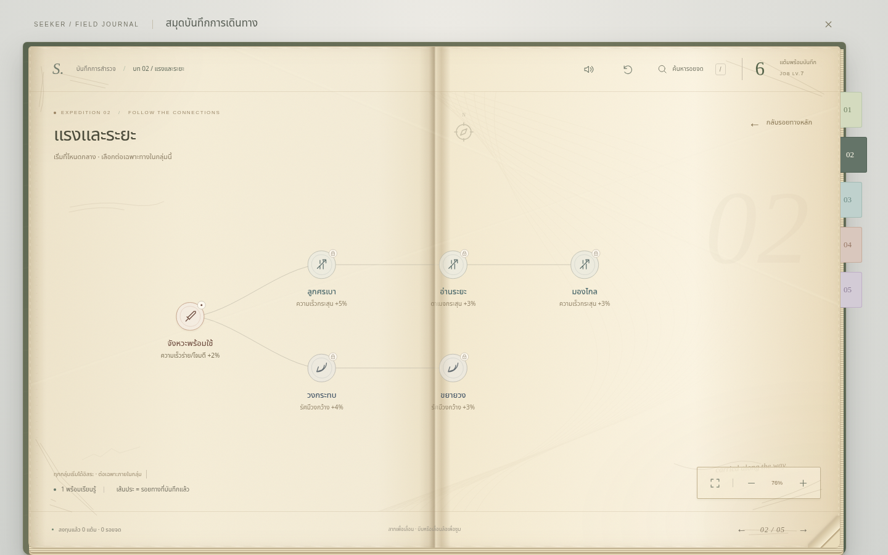
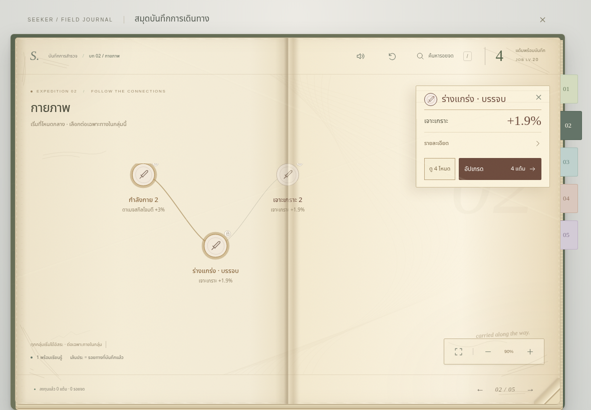
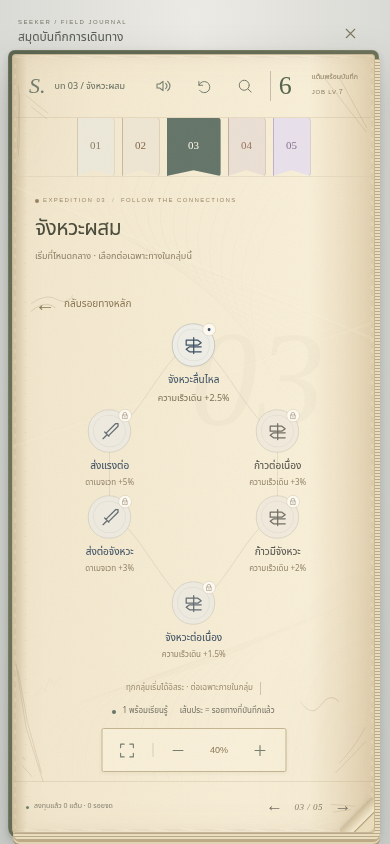

# Independent skill groups — revision 3

Base: `60fdceb` (current main, PR118 retained). Branch: `codex/independent-skill-groups`.
No multiplayer PR115, new-skills PR102, deployment, or CI redesign is included.

## Interpretation and scope

The current UI has **51 displayed page groups, 378 active nodes including origin**.
The old `category`, `section`, and `groups` arrays also describe **206 legacy nodes**
retained for saved ownership/bonuses and compatibility APIs; they are not offered
as new journal routes. They are not deleted or silently converted. Thirty bridge
IDs remain marked `retired` for migration provenance.

A displayed major group is the unit of independence. A chapter is only a page
index, including chapters 3–5. Regular and mastery pages are separate local
scopes; the shared hub is navigation, not an unlock requirement. This deliberately
removes same-line prior-chapter prerequisites too, rather than disguising them as
chapter progression. Existing profession rules for legacy nodes remain unchanged.

[Every active node and retired bridge, before/after](skill-tree-node-audit.csv)
records effects and ALL/ANY prerequisites against the base SHA.

## Before → after

| Offending paths | Change and real consumer |
|---|---|
| `lesson.strike` attack → melee bonus (which can apply beyond attack-scaled skills) | Root of that branch uses `damagePct:2`; `computeSkill` applies it to Damage-tagged skills before melee specialization. The shared foundation root remains HP. |
| `lesson.rhythm` melee → `path.impact` attack → projectile speed/damage or area radius | Impact now starts independently with action speed 2%, affecting combat skill cast time and cooldown, including magical projectiles and healing areas. |
| `path.horizon` → `advanced.power` projectile damage → area radius/damage | Independent action-speed root 2.5%; projectile and area specializations remain separate. |
| `lesson.care` heal → `lesson.shelter` defense; `path.ward` barrier → recovery heal → endurance defense | Defense starts from shared HP; support's barrier, healing, defense and movement choices branch from HP directly. No barrier prerequisite for healing or defense. |
| `path.endurance` → `advanced.guard` heal → defense/barrier | Independent HP +12 root. The previous +5% healing moves to the healing branch; the previous +12 HP there moves to the root. Defense no longer follows barrier at `advanced.longwalk`. |
| `path.burst` + `path.step` → `advanced.flow` area damage → spell or movement; ALL join at `advanced.continuum` | Independent move-speed 2.5% root, universally useful to both descendants. Endpoint grants move speed 1.5% and accepts either local branch, rather than forcing spell investment for movement. |
| Physical line attack-damage roots → penetration (also used by magic and ally hits); damage line attack/magic roots → damage bonus (also usable by VIT-scaled damage) | Across chapters 2–5 and mastery, roots grant action speed `1.2 × stage multiplier` rather than a restricted damage formula. Tested with physical/magic/heal/barrier/summon compilers. Later physical/stat branches retain specialization. |
| Element line elemental-only root → poison chance usable with physical attacks | Roots use the same numeric `damagePct` increase; it scales physical or elemental initiating damage, which also determines poison-proc damage in `hurtMonster`. Element/poison specializations retain their own effects. |
| Speed roots cast speed → cooldown (also useful for movement skills) | Retain action speed and add only `0.5 × stage multiplier` movement recharge at roots. `movementSkill` consumes recharge separately; cast speed alone does **not** change movement recharge. |
| Treasure root and material branch contained projectile-only bonuses | Keep exact loot bonuses; remove projectile bonuses and bow-only description. Loot investment no longer assumes a weapon type. |
| Every mastery chain alternated A/B effects | Shared root now forks into A and B chains. A build can choose its specialization without alternating purchases. |
| Chapter gates 3/7/17/25; old chapter joins → later entries; 30 bridges → another line's join | All visible groups start independently. Retire bridges. Local joins require 3 or 4 investments in that same group, already satisfied by either ordinary internal route. |

Crit chance/multiplier, MP/reduction, guardian HP/defense, and agility/movement
roots already serve their own branches and retain their bonuses. No new combat
formula, rewards, character levels, gear rules, or global balance multipliers.
Root sizes remain authored data. Ownership is one point per ID, not a multi-rank field. A complete line has 38 meaningful purchases,
leaving one of 39 Job Points freely assignable, instead of adding filler points.
The existing pure-line balance check is adapted to the removal of three shared
prerequisites: 1.40–2.05× damage and 1.45 maximum line spread (previously
1.45–2.00 and 1.35). Measured sword physical/damage/speed/crit: 1.911/1.960/
1.420/1.696×; staff damage/speed/element/crit: 1.862/1.810/2.015/1.703×.
Caps remain unchanged and tested; no stats were inflated to restore obsolete
mandatory melee investment.

## Allocation, saves and explanation

`allocationGroup` is canonical for active nodes. `requires` and `requiresAny`,
local point counts, route plans and drawn links share the same group. Auto-path
rejects outside parents even if already owned; it never buys another group.
Zero/insufficient funds and stale plans leave the entire character unchanged.

Tree revision 3 keeps every known non-retired ID and unused point, including
valid old descendants whose internal prerequisite changed. It refunds each
retired/missing ID once, then stamps the revision. It does not reset a character.
Character schema stays v12. Paid respec returns remaining owned spend with its
existing gold/town rules. Unrelated gear, skills, quests, inventory and appearance
are preserved. The generator reapplies the new contract and is idempotent.

Chapters have no lock or spending progress banner. The footer explicitly says
that groups start independently. Node descriptions are generated from their
actual local parents. Local locked endpoints still show their complete priced
route; previews list only that group. Root and mastery layouts retain the same
paper, ink, font, controls and journal navigation.

## Validation and visual review

Reference Library identity: `libfile_96be3177ac988191941878ab471798fa`,
`1000194390.jpg`. `prepare_materialize` resolved the item but the required byte
transfer failed with HTTP 403. Its pixels were **not** inspected in this executor;
no claim of screenshot-based comparison is made. Repository/runtime evidence was
used for the independent code audit and visual checks.

Final validation and screenshot identities are recorded below before delivery.

### Delivery review record — 2026-10-08

- `npm test`: **433 passed**. Includes every active route/group, exact and
  insufficient/zero budgets, foreign-parent rejection, formula effects, legacy
  preservation, migration idempotence, and refund/respec accounting.
- `npm run test:tools`: **161 passed**, after `npm ci` restored the merged PR118
  Acorn dependency in the executor. No workflow or gate was changed.
- `npm run build`: passed. Generator run twice: identical data hashes.
- Chromium: desktop 1440×900, tablet 1180×820 and phone 390×844 line pages,
  independent roots, route preview/purchase, gestures and journal checks passed;
  actual main-game line traversal passed on tablet/phone landscape.
- WebKit: line-page, route-purchase and journal interaction checks passed in the
  matching `mcr.microsoft.com/playwright:v1.56.1-noble` container. Native executor
  WebKit lacked host libraries. Its container live-save test passed using the
  supported URL override after the auto-started server timed out.
- **Both engines' actual main-game Continue → bridge migration → purchase →
  save → reload/Continue → respec passed**, with no page errors. Reports below.
- Final screenshots were inspected as actual rendered pixels, separately from
  assertions. Paper/ink typography, neutral root gains, local edges, chapter
  tabs and priced inspector remain recognizable. Fixed graph depth for ANY joins,
  obsolete external-root spacing, four-way support canvas bounds, phone flow's
  bottom-label space, and the overly long support title.
- Wide support branches and long line/mastery pages intentionally pan; not every
  node is visible simultaneously at readable zoom. No physical-iPad performance
  or hardware-touch claim is made. The reference-image HTTP 403 remains a limit.
- Decision: ready for **draft review**, not merged or deployed. CI remains the
  authority for the exact committed source and mandatory premerge checks.

Artifact and implementation hashes: [SHA256SUMS](review/skill-tree-independence/SHA256SUMS).
[Chromium line report](review/skill-tree-independence/chromium-lines.json),
[Chromium save report](review/skill-tree-independence/chromium-save.json),
[WebKit save report](review/skill-tree-independence/webkit-save.json).

Desktop: independent impact root and projectile/area branches:

Tablet: four-point route preview stays inside its group:

Phone: neutral movement root, spell/movement choices, and an either-branch endpoint:

