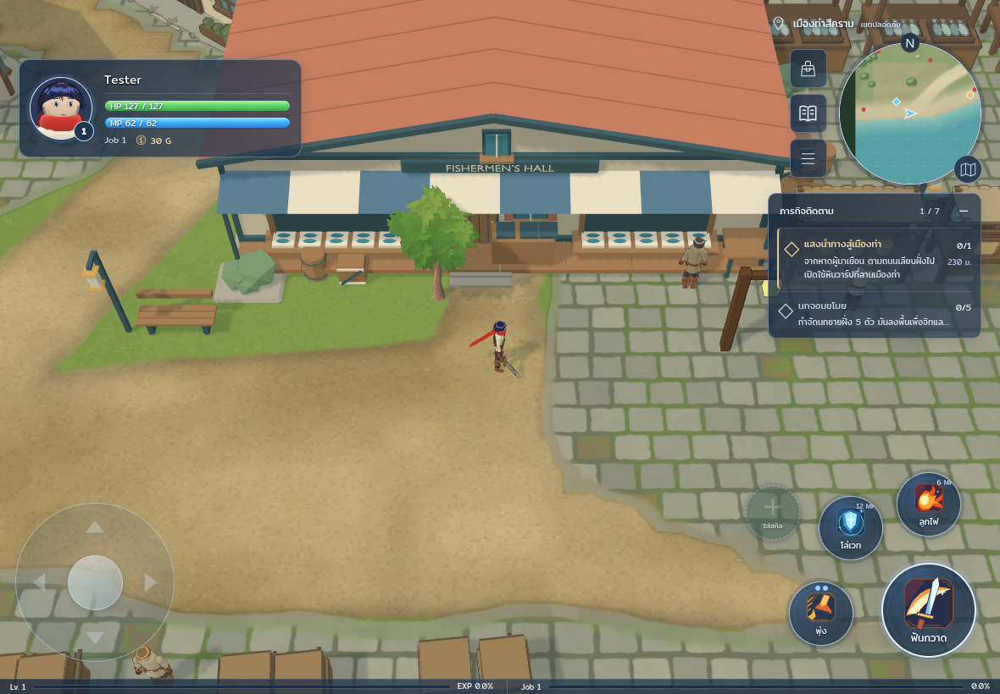
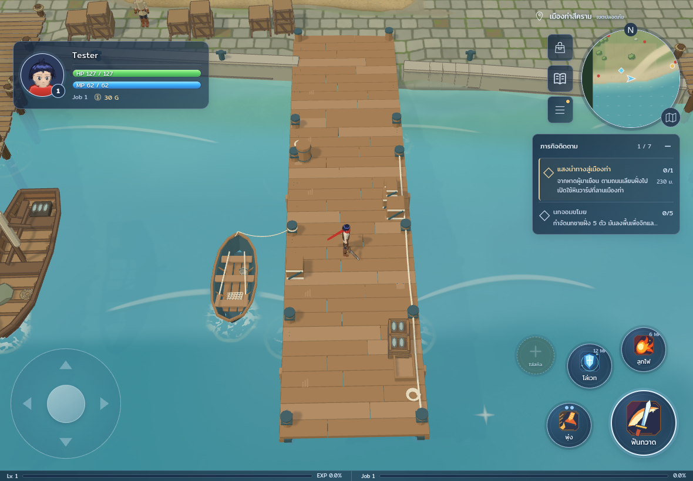
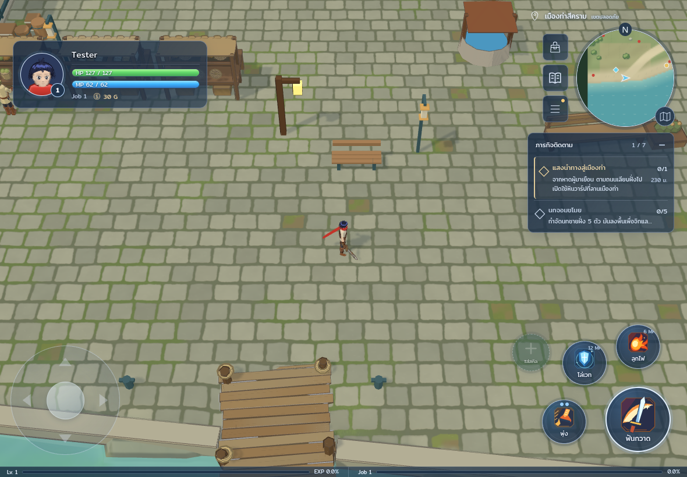
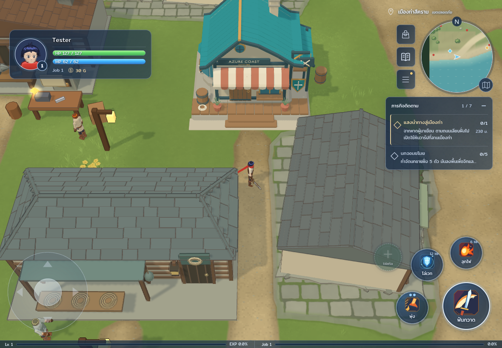
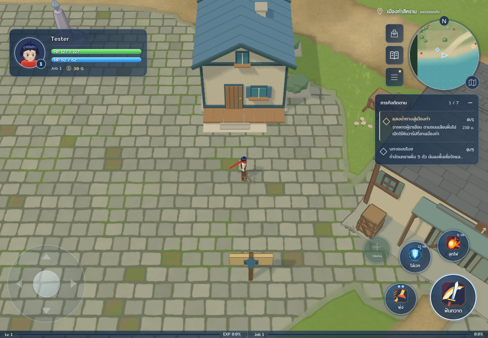

# Harbor V4 integration review

Preserved base: `6ae28dd1af73df07f09040600d4ac31db8acf26e`. PR42 and the
separate skilltree prototype are excluded. This branch is for draft review;
merging and replacing the shared game or Lab are not authorized.

The unchanged accepted GLB is 2,396,836 bytes with SHA256
`3ccdeef84a318815652d9b5ab5f590f9549d5227b8ca9ea93ee5b288b4f9171f`.
Prototype Ground, Water and straight Quay are excluded. The game retains its own
terrain, trees, water, curved quay, paths and lighting. The full-zone source
supplies one Pier and one Boat, with the complete mooring rope owned by Boat.

Open the opt-in build with `?fresh=1&seed=9&quality=medium&dynres=0&harbor=v4`.
See [local reproduction and placement](../HARBOR-V4-LOCAL.md) and
[matched performance measurements](performance-summary.md). Build and three
focused collision tests passed; the 103-sample pier approach probe passed with
supported rendered/collision height difference at most 1.1 mm. All five images
below are final game-camera captures after the approach fit and Quay exclusion.

The software-rendered measurements show 5.8–10.2% fewer triangles and 1–2 more
draw calls. Frame timings varied both ways; no physical-iPad FPS is claimed.
Native Library screenshot saving failed with HTTP 401 before copies were saved.
These repository PNGs preserve the final visible evidence.

