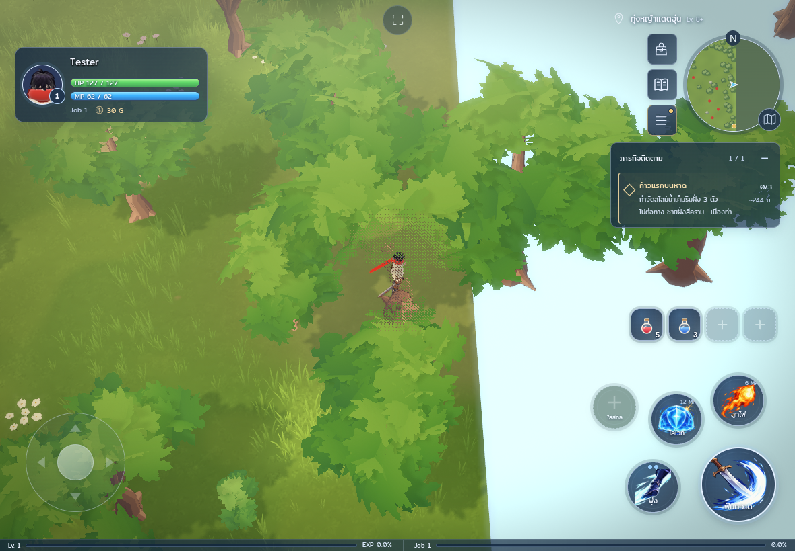
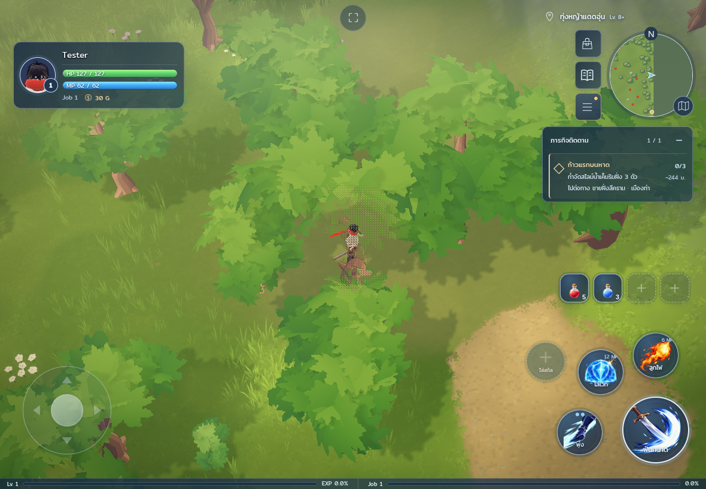
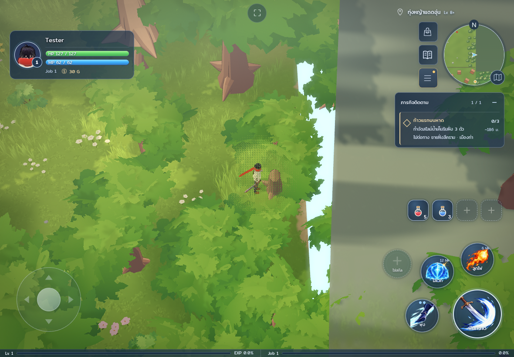
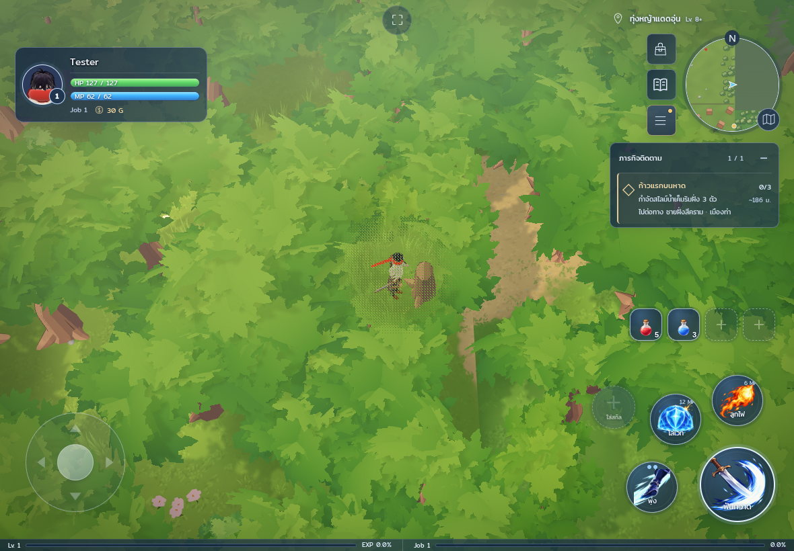
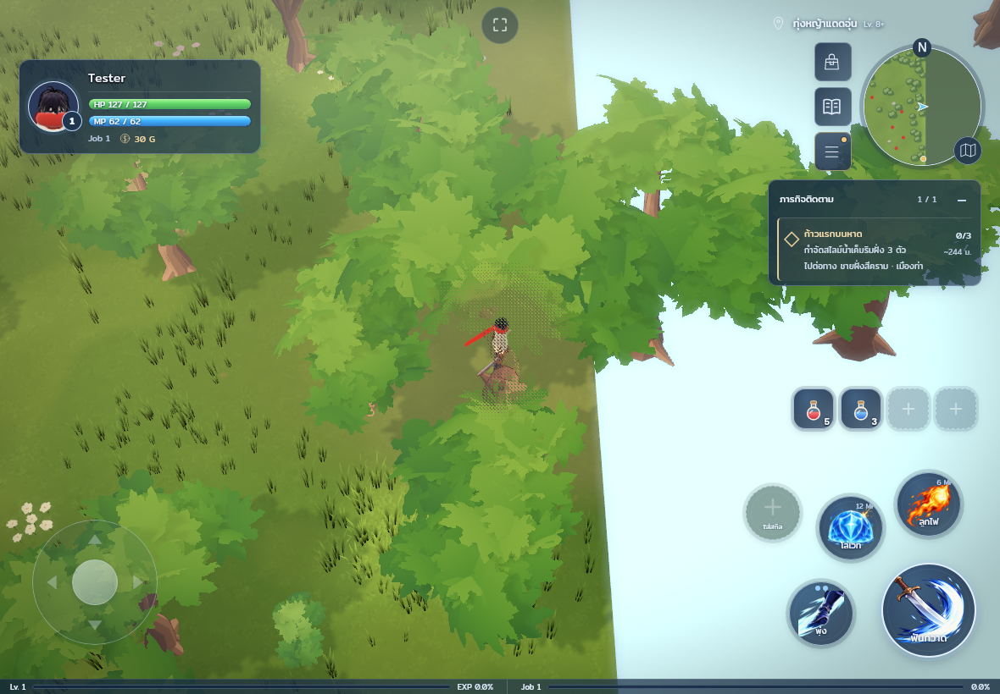
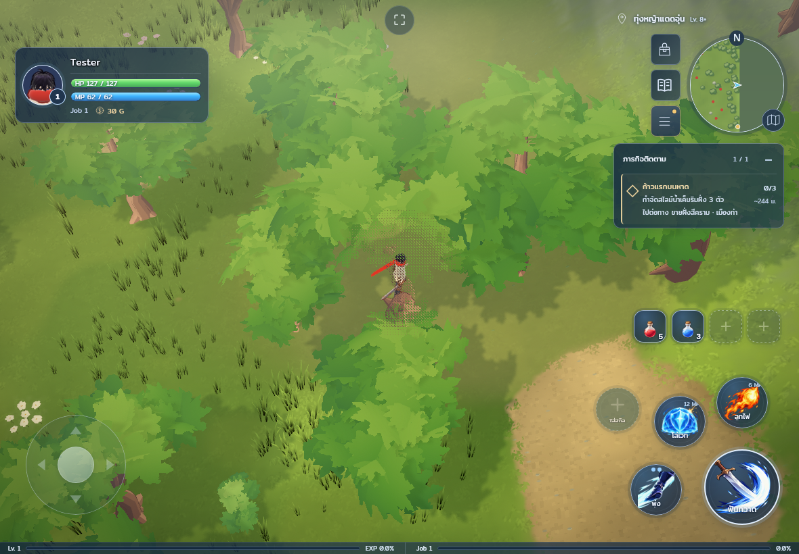
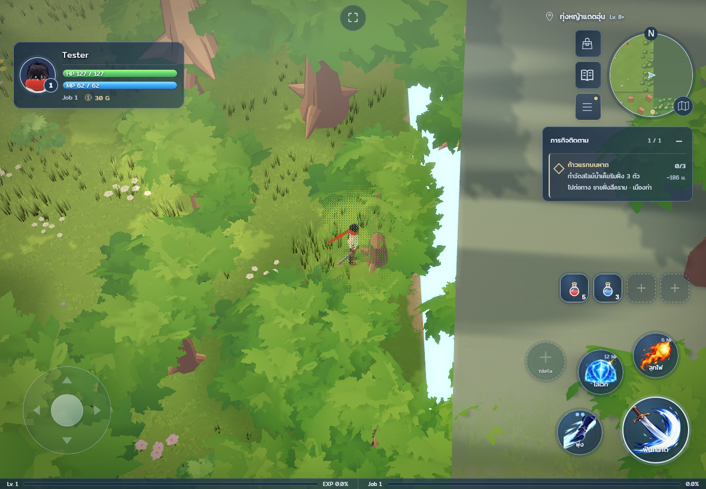
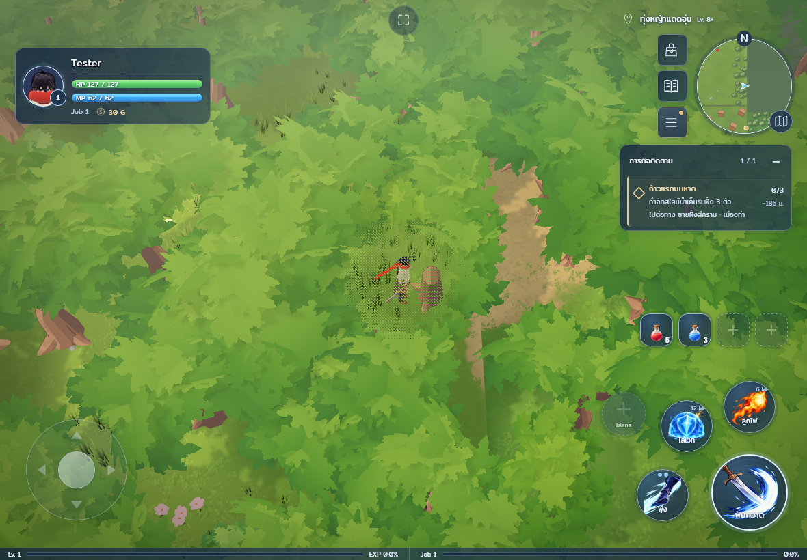

# PR99 actual terrain seam views

These eight inspected PNGs were copied byte for byte from the saved built-game
captures. `verification.json` records their SHA-256 values, global player positions
and capture revisions. No image was retouched, regenerated, resized or annotated.

Before: main `380e3b077d422e968e0d8558e0cbdf255f9a8211`.
After: `e6eb266aa2bf8d5c6d7146075f7c6037c834c28f`, based on current main `24ff2b4`.
The intervening main change replaces item icons; the HUD bottle difference is
unrelated to this rendering patch. Both captures use the same 1180x820 touch
camera and medium quality with shadows/post-processing.

| View | Before | After |
| --- | --- | --- |
| Chromium, missing northern ground |  |  |
| Chromium, high rectangular skirt |  |  |
| Linux WebKit, missing northern ground |  |  |
| Linux WebKit, high rectangular skirt |  |  |

The cyan void and exposed rectangular face are absent after the terrain repair.
All scenery instances remain, and roots stand on the rendered owner's ground.
Coverage and edge-height tests independently check the geometry behind the canopy.
WebKit's black grass-root sampling defect remains visible here; its separate fix
is in PR98. These views do not reproduce or establish a fix for black monsters or
blank minimap geography. Review used actual still pixels, not normal-speed video
or physical iPad/Safari Metal. See [the full record](../../TERRAIN-SEAM-REPAIR-20261007.md).
