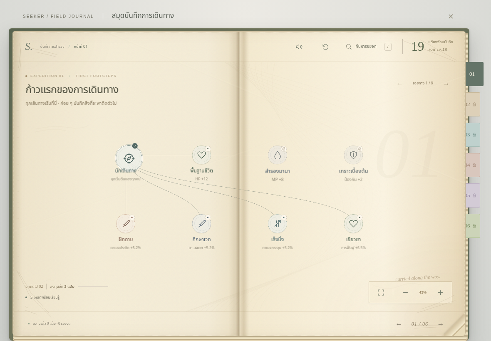
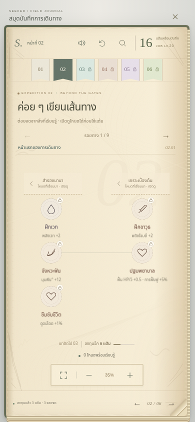
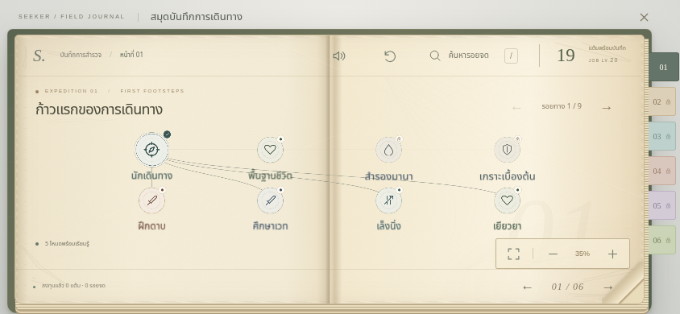

# Worn skill journal in Azure Coast

Current main base: `6ae28dd1af73df07f09040600d4ac31db8acf26e`.
Accepted presentation source: local journal review 05, originally based on PR42
`c90309a295062081768627e5f024576737dcd493`. PR42 and Harbor PR43 are not merged here.

The passive menu now opens the worn journal directly, with current foundation nodes
and actual origin neighbours together on the first spread. Early chapters contain
ordinary paginated skill paths; chapter IV+ has dense group drilldowns with a return
to the same spread. Branch colors, static paper wear, finite ink reveals, smooth
pan/zoom, sliding details, forward/back leaf turns and original generated paper
rustles come from the accepted prototype. Reduced motion skips the fold. Sound has
mute/SFX controls, gesture-only AudioContext startup and explicit cleanup on exit.
Only audio preferences use `frontier-demo.journal-paper-sfx.v1`; blocked storage
retains settings in the current Panels instance. Pagination/camera state is transient.

This is a presentation adaptation to main's **207 current nodes**, not a copy of the
prototype's 233-node PR42 tree. `data/`, core rules, saves, HUD and world assets stay
unchanged. The read-only journal model derives chapter labels from current section
minima; node eligibility still comes from `jobNodeState`. Current gates, predecessor
checks, Job Lv5 profession choice, one-job restriction and compatibility remain.
Ordinary early paths stay mixable under those existing rules. No new class timing,
thresholds, balance, mana/elemental data or combat infusion is introduced.

Purchases use the original `allocateJobNode` then `Panels.changed()` to refresh real
derived stats and save through the existing callback. Respec keeps the original fee
and additionally verifies the existing town requirement at both display and click.
The opaque job panel holds the completed world frame and pauses resolution-governor
updates; normal world drawing resumes on exit. Simulation was already paused by the
existing panel contract. Other workspaces and the live HUD retain their source.

Main publishing previously rebuilt `/lab/` from main. This release instead preserves
the exact Lab directory from the last actual successful Pages publish. It identifies
the successful deploy-pages step, even if a subsequent live check failed, downloads
that run's Pages artifact and copies its Lab unchanged. Missing/incomplete artifacts
stop publishing. Effects-branch workflow-run publishing retains its existing path.
A PR CI preflight verifies artifact availability before merge.

## Local verification

- Production build passed; all 143 core tests passed.
- 32 focused progression/save/workspace/core checks passed before the full core run.
- Desktop 1440×900, iPad touch 1180×820, phone touch 390×844 and reduced-motion phone:
  no autoplay, real browser audio signal, mute/volume, immediate turns, one inert leaf,
  rapid cancellation, no gesture purchases, predecessor blocking, three mixable real
  allocations, early ordinary paths, spread memory and repeated open/close passed.
- iPad made 17 actual UI purchases under the original rules, kept a second profession
  blocked, opened chapter IV, exercised native pinch/pan/cancellation and returned
  from group drilldowns including the second dense spread without spending points.
- Full-game Continue → purchase → reload → Continue preserved v4 nodes, gear, mods,
  materials, stats, skills, appearance, gold and persisted audio preferences.
- Compact landscape dense chapters use one row per spread; 44px+ branch targets
  stay inside the map, clear the heading, and accept native touch input.
- Existing mod/skill/craft workspaces passed a focused iPad review. Browser page errors
  were empty. Native settled captures were inspected; no hardware FPS claim is made.
- All 24 tool tests, including two Lab-preservation regression tests, passed. YAML and
  shell syntax were checked. Local artifact byte download is restricted, so the PR
  preflight checks that transfer on the GitHub runner.

Reproduce with the existing dependencies:

```sh
npm run build
node tests/browser/skill-journal.mjs
node tests/browser/journal.mjs
node tests/browser/workspaces.mjs
# Serve dist with Vite preview, then exercise actual saved-game Continue:
node tests/browser/journal-save.mjs
```

`CHROMIUM_EXECUTABLE` can select system Chromium. `BROWSER=webkit` uses Playwright
WebKit for journal/workspace checks. `JOURNAL_URL` runs the focused checks against the
full game; without it, they use the real Game/Panel classes without the 3D renderer.
`JOURNAL_SAVE_URL` selects the actual root-game URL for the saved-game check. Tests
use isolated browser contexts; they do not mutate any other player's storage.

Physical Safari/iPad remains an owner-device check. PR CI supplies Chromium/WebKit
smoke, UI and touch coverage; publishing must wait for the relevant successful runs.

Native Chromium captures from the current integrated UI:






